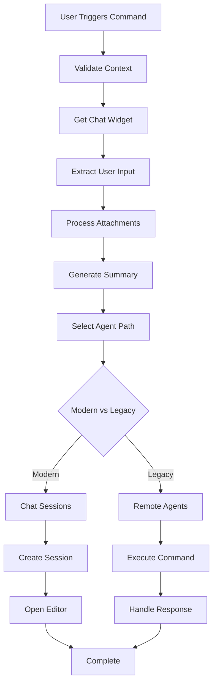

# Comprehensive Analysis: `workbench.action.chat.createRemoteAgentJob` Command

## Executive Summary

The `workbench.action.chat.createRemoteAgentJob` command is VS Code's mechanism for delegating chat conversations to external coding agents. It provides a bridge between VS Code's chat interface and external services that can perform coding tasks, pull request creation, and other development workflows.

## Command Overview

**Command ID:** `workbench.action.chat.createRemoteAgentJob`
**Location:** `src/vs/workbench/contrib/chat/browser/actions/chatExecuteActions.ts`
**Class:** `CreateRemoteAgentJobAction extends Action2`

### Key Characteristics
- **Purpose**: Delegate chat conversations to remote coding agents
- **Context**: Appears in chat interface when remote coding agents are available
- **Integration**: Works with VS Code's extension system and command infrastructure
- **State Management**: Uses context keys for UI state and availability

## Technical Architecture

### 1. Core Implementation

```typescript
export class CreateRemoteAgentJobAction extends Action2 {
    static readonly ID = 'workbench.action.chat.createRemoteAgentJob';
    
    constructor() {
        const precondition = ContextKeyExpr.and(
            whenNotInProgress,
            ChatContextKeys.remoteJobCreating.negate(),
        );
        
        super({
            id: CreateRemoteAgentJobAction.ID,
            title: localize2('actions.chat.createRemoteJob', "Delegate to Coding Agent"),
            icon: Codicon.sendToRemoteAgent,
            precondition,
            // Menu and UI configuration...
        });
    }
}
```

### 2. Service Dependencies

The command depends on several key services:

#### Core Services
- **`ICommandService`**: Executes extension-contributed commands
- **`IContextKeyService`**: Manages UI state and preconditions
- **`IChatWidgetService`**: Accesses the current chat interface
- **`IQuickInputService`**: Shows agent selection UI

#### Specialized Services
- **`IRemoteCodingAgentsService`**: Manages registered coding agents (legacy path)
- **`IChatSessionsService`**: Handles modern chat session management
- **`IChatAgentService`**: Provides chat agent functionality
- **`IWorkspaceContextService`**: Gets workspace information for file paths

### 3. Context Keys System

The command uses VS Code's context key system for state management:

```typescript
// Key context keys used by the command
export namespace ChatContextKeys {
    // Controls when remote job creation is in progress
    export const remoteJobCreating = new RawContextKey<boolean>('chatRemoteJobCreating', false);
    
    // Indicates if any remote coding agent is available
    export const hasRemoteCodingAgent = new RawContextKey<boolean>('hasRemoteCodingAgent', false);
    
    // Controls when UI is locked to coding agent
    export const lockedToCodingAgent = new RawContextKey<boolean>('lockedToCodingAgent', false);
}
```

### 4. Execution Flow

#### Phase 1: Preconditions & Setup
1. **Context Validation**: Checks that no request is in progress and no remote job is being created
2. **Widget Access**: Gets the current chat widget via `IChatWidgetService`
3. **Session Validation**: Ensures a valid chat session exists
4. **State Management**: Sets `remoteJobCreating` context key to `true`

#### Phase 2: Input Processing
1. **Prompt Extraction**: Gets user prompt from chat widget input
2. **Context Attachment**: Processes attached files and context variables
3. **Chat History**: Analyzes previous chat conversations for context
4. **Summary Generation**: Creates context-aware summary for the agent

#### Phase 3: Agent Selection & Delegation

The command supports two execution paths:

##### Modern Path (Chat Sessions)
```typescript
private async createWithChatSessions(
    chatSessionsService: IChatSessionsService,
    // ... other parameters
) {
    // 1. Get available chat session contributions
    const contributions = chatSessionsService.getAllChatSessionContributions();
    
    // 2. Let user pick an agent
    const agent = await this.pickCodingAgent(quickPickService, contributions);
    
    // 3. Create new chat session via extension
    const newChatSession = await chatSessionsService.provideNewChatSessionItem(
        type, { prompt: userPrompt, request, metadata }, token
    );
    
    // 4. Open new editor for the session
    await editorService.openEditor({
        resource: ChatSessionUri.forSession(type, newChatSession.id),
        options: { pinned: true, preferredTitle: newChatSession.label }
    });
}
```

##### Legacy Path (Remote Coding Agents)
```typescript
private async createWithLegacy(
    remoteCodingAgentService: IRemoteCodingAgentsService,
    commandService: ICommandService,
    // ... other parameters
) {
    // 1. Get registered remote coding agents
    const agents = remoteCodingAgentService.getAvailableAgents();
    
    // 2. Let user pick an agent
    const agent = await this.pickCodingAgent(quickPickService, agents);
    
    // 3. Execute the agent's command with context
    const result = await commandService.executeCommand(agent.command, {
        userPrompt,
        summary: summary || userPrompt,
        _version: 2, // Indicates support for new response format
    });
    
    // 4. Handle response (PR info, status message, or error)
    this.handleAgentResponse(result, chatModel, addedRequest, widget);
}
```

#### Phase 4: Response Handling
1. **Progress Updates**: Shows progress messages in chat interface
2. **Result Processing**: Handles different response formats (PR content, messages, errors)
3. **UI Updates**: Updates chat interface with results
4. **Cleanup**: Resets context keys and completes the request

## Extension Integration Points

### 1. Remote Coding Agents Extension Point

Extensions can contribute remote coding agents via the `remoteCodingAgents` extension point:

```json
{
  "contributes": {
    "remoteCodingAgents": [
      {
        "id": "myCodeAgent",
        "command": "myExtension.delegateToAgent",
        "displayName": "My Code Agent",
        "description": "Handles coding tasks remotely",
        "when": "config.myExtension.enabled"
      }
    ]
  }
}
```

### 2. Command Handler Implementation

Extensions must implement the command referenced in their contribution:

```typescript
vscode.commands.registerCommand('myExtension.delegateToAgent', async (args) => {
    const { userPrompt, summary, _version } = args;
    
    // Process the request...
    
    if (_version === 2) {
        // Return structured response for modern clients
        return {
            title: "Pull Request Created",
            url: "https://github.com/user/repo/pull/123",
            description: "Changes implemented as requested"
        };
    } else {
        // Return simple string for older clients
        return "Task completed successfully";
    }
});
```

## CLI Integration Patterns

### 1. Direct Command Execution

For CLI integration, you can execute the command directly:

```bash
# Via VS Code CLI (when running)
code --command workbench.action.chat.createRemoteAgentJob

# Via programmatic API
vscode.commands.executeCommand('workbench.action.chat.createRemoteAgentJob');
```

### 2. Custom CLI Command Integration

To integrate with a custom CLI, you would:

#### Step 1: Create Extension with Remote Agent
```typescript
// extension.ts
export function activate(context: vscode.ExtensionContext) {
    // Register your agent command
    const disposable = vscode.commands.registerCommand(
        'myCli.handleCodingRequest', 
        handleCodingRequest
    );
    context.subscriptions.push(disposable);
}

async function handleCodingRequest(args: any) {
    // Bridge to your CLI tool
    const response = await executeCliCommand(args.userPrompt, args.summary);
    return {
        title: response.title,
        url: response.pullRequestUrl,
        description: response.summary
    };
}
```

#### Step 2: Configure Extension Contribution
```json
{
  "contributes": {
    "commands": [
      {
        "command": "myCli.handleCodingRequest",
        "title": "Handle Coding Request"
      }
    ],
    "remoteCodingAgents": [
      {
        "id": "myCliAgent",
        "command": "myCli.handleCodingRequest",
        "displayName": "My CLI Agent",
        "description": "Delegates to my custom CLI"
      }
    ]
  }
}
```

#### Step 3: CLI Implementation
```typescript
// cli-bridge.ts
export async function executeCliCommand(prompt: string, summary: string) {
    // Execute your actual CLI tool
    const result = await spawn('your-cli-tool', [
        '--prompt', prompt,
        '--summary', summary,
        '--format', 'json'
    ]);
    
    return JSON.parse(result.stdout);
}
```

## Service Architecture Deep Dive

### 1. RemoteCodingAgentsService

**Location:** `src/vs/workbench/contrib/remoteCodingAgents/common/remoteCodingAgentsService.ts`

```typescript
export interface IRemoteCodingAgent {
    id: string;
    command: string;          // Command to execute
    displayName: string;      // UI display name
    description?: string;     // Description for UI
    followUpRegex?: string;   // Pattern for follow-up detection
    when?: string;           // Context key expression for availability
}

export class RemoteCodingAgentsService {
    // Manages agent registration and availability
    registerAgent(agent: IRemoteCodingAgent): void;
    getAvailableAgents(): IRemoteCodingAgent[];
}
```

### 2. ChatSessionsService

**Location:** `src/vs/workbench/contrib/chat/common/chatSessionsService.ts`

Provides modern session-based approach for external chat integrations:

```typescript
export interface IChatSessionsExtensionPoint {
    readonly type: string;
    readonly name: string;
    readonly displayName: string;
    readonly description: string;
    readonly when?: string;
    readonly capabilities?: {
        supportsFileAttachments?: boolean;
        supportsToolAttachments?: boolean;
    };
}
```

### 3. Command Service Integration

**Location:** `src/vs/workbench/services/commands/common/commandService.ts`

The command service handles extension activation and command execution:

```typescript
async executeCommand<T>(id: string, ...args: any[]): Promise<T> {
    // 1. Check if command is registered
    // 2. Activate extensions if needed
    // 3. Execute command handler
    // 4. Return result
}
```

## Configuration and Context

### 1. Context Key Expressions

The command's availability is controlled by context expressions:

```typescript
// Command is available when:
ContextKeyExpr.and(
    ChatContextKeys.hasRemoteCodingAgent,        // At least one agent available
    ChatContextKeys.lockedToCodingAgent.negate(), // Not locked to specific agent
    whenNotInProgress,                           // No active request
    ChatContextKeys.remoteJobCreating.negate()   // Not currently creating job
)
```

### 2. Menu Integration

The command appears in specific menus within the chat interface:

```typescript
menu: [
    {
        id: MenuId.ChatExecute,          // Primary chat execution menu
        group: 'navigation',
        order: 3.4,
        when: ContextKeyExpr.and(ChatContextKeys.hasRemoteCodingAgent, ...)
    },
    {
        id: MenuId.ChatExecuteSecondary, // Secondary/overflow menu
        group: 'group_3',
        order: 1,
        when: ContextKeyExpr.and(ChatContextKeys.hasRemoteCodingAgent, ...)
    }
]
```

## Data Flow and Communication

### 1. Request Processing Flow



### 2. Context Information Passed to Agents

When executing an agent command, the system passes:

```typescript
interface AgentExecutionContext {
    userPrompt: string;      // Current user input
    summary: string;         // Chat history + attached files summary  
    _version: number;        // API version (2 for modern format)
    attachedFiles?: string[]; // Workspace-relative file paths
    chatHistory?: string;    // Previous conversation context
}
```

### 3. Expected Response Formats

#### Version 2 Response (Modern)
```typescript
interface ModernAgentResponse {
    title: string;           // Display title
    url?: string;           // Link to result (e.g., PR URL)
    description?: string;   // Description of what was done
    // Additional metadata as needed
}
```

#### Legacy Response
```typescript
type LegacyAgentResponse = string; // Simple status message
```

## Error Handling and Edge Cases

### 1. No Agents Available
- Context key `hasRemoteCodingAgent` becomes false
- Command becomes unavailable in UI
- Graceful degradation to standard chat flow

### 2. Agent Selection Cancelled
```typescript
const agent = await this.pickCodingAgent(quickPickService, agents);
if (!agent) {
    chatModel.completeResponse(addedRequest);
    return; // Graceful exit
}
```

### 3. Command Execution Failures
```typescript
try {
    const result = await commandService.executeCommand(agent.command, context);
    // Handle success
} catch (error) {
    chatModel.acceptResponseProgress(addedRequest, {
        kind: 'markdownContent',
        content: new MarkdownString('Coding agent session cancelled.')
    });
}
```

## Performance Considerations

### 1. Context Key Updates
- Context keys are updated reactively based on agent availability
- Debounced to prevent excessive UI updates

### 2. Extension Activation
- Extensions are activated on-demand when commands are executed
- Supports both eager and lazy activation patterns

### 3. Chat History Processing
- History is processed and summarized before sending to agents
- Includes cutoff logic to prevent excessive context

## Security Model

### 1. Extension Permissions
- Agents run with extension permissions
- Subject to VS Code's extension security model
- Proposed API feature requires explicit enablement

### 2. Context Isolation
- Each agent execution is isolated
- No direct access to VS Code internals beyond provided APIs

### 3. User Consent
- User explicitly selects which agent to use
- Clear indication when delegating to external services

## Custom Integration Examples

### Example 1: Simple CLI Integration

```typescript
// 1. Extension registration
vscode.commands.registerCommand('myAgent.execute', async (args) => {
    const { userPrompt, summary } = args;
    
    // Call your CLI
    const proc = spawn('my-coding-cli', ['--task', userPrompt], {
        stdio: ['pipe', 'pipe', 'pipe']
    });
    
    return new Promise((resolve, reject) => {
        let output = '';
        proc.stdout.on('data', (data) => output += data);
        proc.on('close', (code) => {
            if (code === 0) {
                resolve({
                    title: "Task Completed",
                    description: output,
                    url: extractUrlFromOutput(output)
                });
            } else {
                reject(new Error(`CLI failed with code ${code}`));
            }
        });
        
        // Send context to CLI
        proc.stdin.write(JSON.stringify({ userPrompt, summary }));
        proc.stdin.end();
    });
});
```

### Example 2: HTTP API Integration

```typescript
vscode.commands.registerCommand('cloudAgent.execute', async (args) => {
    const response = await fetch('https://my-coding-service.com/api/execute', {
        method: 'POST',
        headers: { 'Content-Type': 'application/json' },
        body: JSON.stringify({
            prompt: args.userPrompt,
            context: args.summary,
            version: args._version
        })
    });
    
    if (response.ok) {
        return await response.json(); // Should match expected format
    } else {
        throw new Error(`Service returned ${response.status}`);
    }
});
```

### Example 3: File System Integration

```typescript
vscode.commands.registerCommand('fileAgent.execute', async (args) => {
    const { userPrompt, summary } = args;
    
    // Write context to temporary file
    const tempFile = path.join(os.tmpdir(), `vscode-agent-${Date.now()}.json`);
    await fs.promises.writeFile(tempFile, JSON.stringify({
        prompt: userPrompt,
        summary: summary,
        workspace: vscode.workspace.workspaceFolders?.[0]?.uri.fsPath
    }));
    
    // Execute external tool
    const result = await exec(`my-agent-binary --input "${tempFile}"`);
    
    // Cleanup
    await fs.promises.unlink(tempFile);
    
    // Parse and return result
    return JSON.parse(result.stdout);
});
```

## Monitoring and Debugging

### 1. Command Service Tracing
VS Code logs command execution via `ILogService`:

```typescript
this._logService.trace('CommandService#executeCommand', id);
```

### 2. Context Key Debugging
Use VS Code's context key inspector (Ctrl+Shift+P → "Developer: Inspect Context Keys") to debug context key states.

### 3. Extension Host Debugging
Standard VS Code extension debugging applies - set breakpoints in your agent command handlers.

## Future Extensions

### 1. Streaming Responses
Support for real-time streaming updates from agents during execution.

### 2. Multi-Agent Coordination
Framework for agents to collaborate on complex tasks.

### 3. Enhanced Context Passing
Richer context objects including project structure, git state, etc.

## Summary

The `workbench.action.chat.createRemoteAgentJob` command provides a robust foundation for integrating external coding agents with VS Code's chat interface. Its architecture supports both simple CLI tools and complex cloud services while maintaining security and user experience standards.

Key integration points:
- **Extension System**: Register agents via extensions
- **Command Service**: Handle delegation through command execution
- **Context System**: Control availability and state
- **Chat Interface**: Seamless user experience within existing workflows

The command's design balances flexibility with simplicity, making it accessible for both simple automation scripts and sophisticated AI-powered development tools.